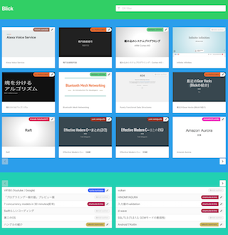

Blick
=====

[][Antikythera]

[Antikythera]: https://github.com/access-company/solomon

My personal side project at [@access-company](https://github.com/access-company), using [Antikythera]!

It aims to provide centralized hub for browsing materials of internal tech-meetings and seminars.

- Trello board: https://trello.com/b/WrovoYZN/blick
    - [Invite link](https://trello.com/invite/b/WrovoYZN/d40543bb2fcb7279069524ba40bb8f94/blick)

## Dev

0. Install [asdf](https://github.com/asdf-vm/asdf) and Erlang, Elixir, Nodejs plugins
0. Install `yarn`
0. `git clone http://github.com/ymtszw/blick.git`
0. `asdf install`
0. `mix deps.get; mix deps.get`
0. `yarn`
0. `yarn start`
