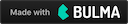

Blick
=========

社内で行われる勉強会やらプレゼン大会やら何やらの資料へのアクセスハブとなることを目指すgear

- [Issues](http://gitbucket.tok.access-company.com:8080/Yu.Matsuzawa/blick/issues)

## Dev

0. [asdf]を入れておく
    - 必要に応じてpluginを入れる。Erlang, Elixir, Nodejsは必須
1. `git clone http://gitbucket.tok.access-company.com:8080/git/Yu.Matsuzawa/blick.git`
2. `asdf install`
3. `npm install`
4. `mix deps.get; mix deps.get`
5. `npm start`

[asdf]: https://github.com/asdf-vm/asdf
